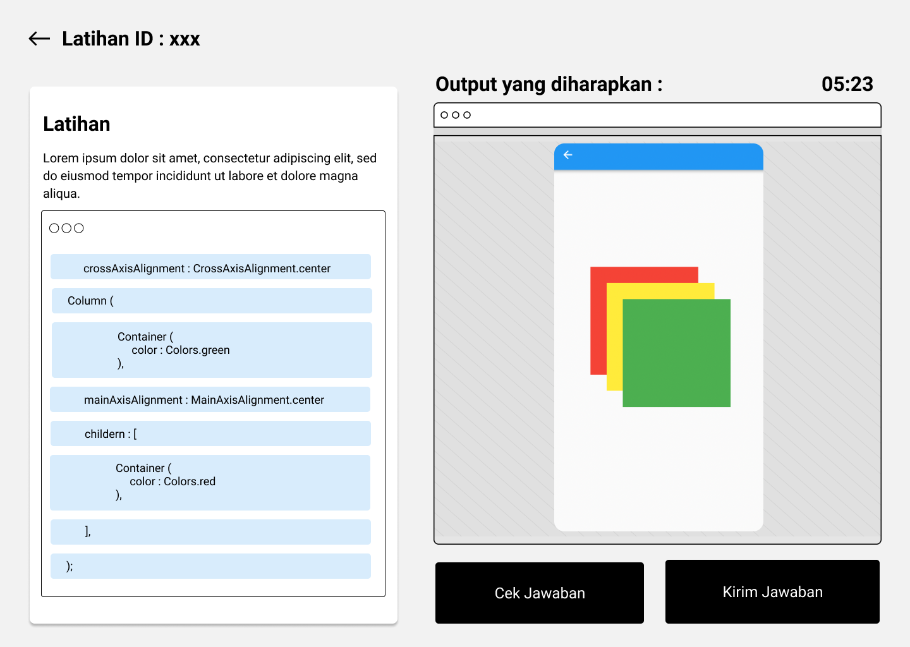

# Easy Flutter
> **Peringatan** : Aplikasi ini dikembangkan untuk kebutuhan  skripsi dan tidak untuk publik. Apabila Anda ingin mempelajari *source code* pada repository ini, silahkan hubungi Pak Prima, dharmayudistira2000@gmail.com (Dharma), atau abdurrasyid.muhasibi.20@gmail.com (Rasyid).

Link Aplikasi : [EasyFlutter](easy-flutter.github.io)

---
##  Latar Belakang
Gaya penulisan kode yang deklaratif membuat penulisan kode Flutter berbeda dengan gaya penulisan kode di native platform pada umumnya. Dengan adanya perbedaan penulisan kode penyusunan antarmuka (layout) pada Flutter, perlu adanya metode yang sesuai agar pelajar dapat memahami konsep penyusunan Flutter Layout.

  

---
## Rumusan Masalah
Bagaimana dampak penerapan ***Construct on Scaffold Concept Map*** dan ***Pre-Scaffolded Parsons Problem*** terhadap nilai *post-test* mahasiswa pada mata kuliah Pemrograman *Mobile* dengan topik *Flutter Layout* ?

---
## Solusi
- *Pre-scaffolded Parsons Problem*
*Pre-scaffolded Parsons Problem* merupakan  pembelajaran  dengan  pendekatan  penyelesaian  kode *(code-completion)* di mana pelajar  harus  menyusun  ulang  blok  kode yang sudah  diacak  untuk  mencapai  solusi  dari permasalahan.
- *Construct on Scaffold Concept Map*
*Construct on Scaffold Concept Map* akan memberikan pelajar kerangka dari peta konsep ahli yang tidak lengkap. Sebagian simpul dan relasi penghubung pada kerangka sudah dihilangkan, sehingga pelajar harus mengisi bagian yang hilang dengan pilihan jawaban yang tersedia untuk melengkapi kerangka peta konsep.

---
## Fitur

### *Code Reconstruction*

  

Fitur ini mengimplementasikan pendekatan *Pre-scaffolded Parsons Problem* sebagai pendekatan baru dalam pembelajaran *Flutter Layout*. Pendekatan *Pre-scaffolded Parsons Problem* dapat mengurangi beban kognitif mahasiswa karena mahasiswa tidak perlu menuliskan baris kode serta dapat membatasi permasalahan yang dihadapi mahasiswa seperti *null pointer exception, uninitialized late variable*, dan beberapa pesan error lain yang sering ditemui ketika menuliskan kode secara langsung.

### *Widget Tree Reconstruction*

  

Fitur ini mengimplementasikan pendekatan *Construct on Scaffold Concept Map* sebagai pendekatan baru dalam pembelajaran *Flutter Layout*. Pendekatan *Construct on Scaffold Concept Map* dapat mengurangi beban kognitif mahasiswa karena mahasiswa tidak perlu membuat peta konsep dari awal, melainkan melengkapi peta konsep dari ahli (dosen) yang sudah disediakan.

---
### Teknologi yang Digunakan
 - [Flutter](https://flutter.dev/)
 - [Cloud Firestore](https://pub.dev/packages/cloud_firestore)
 - [GetX](https://pub.dev/packages/get)
 - [Github Pages](https://pages.github.com/)

---
## Arsitektur Sistem

  

---
## Pengujian Sistem

  

---
## Kesimpulan
Berdasarkan hasil penelitian implementasi ***Construct on Scaffold Concept Map*** dan ***Pre-scaffolded Parsons Problem*** pada aplikasi EasyFlutter, diperoleh kesimpulan bahwa metode ini memiliki **dampak positif yang signifikan** terhadap nilai post-test mahasiswa pada mata kuliah Pemrograman *Mobile* dengan topik *Flutter Layout*.

---
## Demo Aplikasi

### *Code Reconstruction*

### *Widget Tree Reconstruction*

---